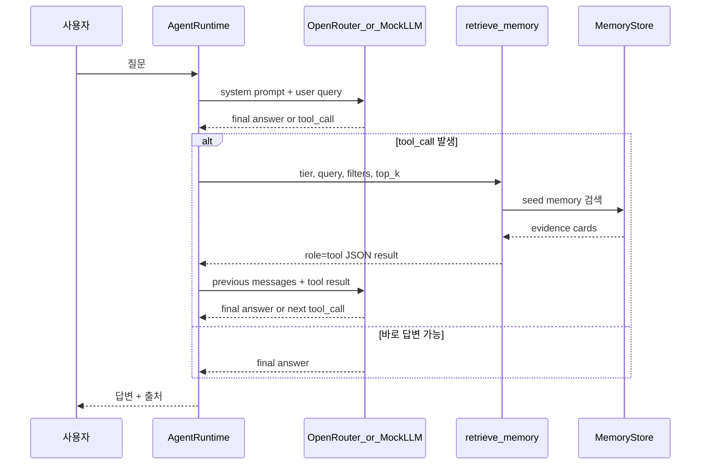

# 조직지식 에이전트 MVP 동작 흐름

작성일: 2026-08-19

이 문서는 `org_agent_mvp` 프로젝트가 어떻게 동작하는지, 어떤 Hermes 구조를 참고했는지, OpenRouter 연결 방식은 무엇인지 정리한다.

코드 기준 파일/함수 호출 흐름은 `docs/code-flow.md`에 별도로 정리한다. 실행 흐름, tool call 구조, 로그 저장 방식이 바뀌면 `code-flow.md`도 함께 수정해야 한다.

---

## 1. 목적

이 프로젝트는 조직지식 AI 플랫폼의 1차 MVP다.

목표는 전체 회사 지식 저장소를 완성하는 것이 아니라, 작은 seed memory를 기반으로 다음 흐름이 실제로 동작하는지 확인하는 것이다.

```text
사용자 질문
→ LLM이 검색 필요 여부 판단
→ retrieve_memory tool call
→ STM / MTM / LTM seed memory 검색
→ evidence card 반환
→ LLM이 tool result를 보고 재판단
→ 부족하면 추가 tool call
→ 최종 답변 + 출처
```

---

## 2. 실행 방법

키 없이 구조 검증:

```powershell
cd C:\ine_project\중기청_조직지식AI플랫폼\org_agent_mvp
python -m org_agent_mvp --mock --verbose --trace --question "오늘 회의 결정이 공식 계획서와 충돌해?"
```

OpenRouter 연결:

```powershell
cd C:\ine_project\중기청_조직지식AI플랫폼\org_agent_mvp
copy .env.example .env
notepad .env
python -m org_agent_mvp --verbose --trace --question "아까 회의에서 다음 일정 뭐였지?"
```

`.env` 파일의 `OPENROUTER_API_KEY=` 오른쪽에 키를 입력하면 된다. 현재 `.env.example`에는 키 입력 공간만 비워두었다.

기본 모델은 한국어 응답 품질을 고려해 Gemma 무료 모델인 `google/gemma-4-31b-it:free`로 고정했다. 다른 무료 모델을 쓰려면 OpenRouter 모델 ID를 `...:free` 형태로 바꾼다.

`--verbose`는 실행 중 이벤트를 터미널에 바로 출력한다. `--trace`는 실행 후 전체 trace를 JSON으로 출력한다.
`--save-log`는 한 턴의 전체 실행 로그를 `logs/turns/*.json`으로 저장한다.

---

## 3. 프로젝트 구조

```text
org_agent_mvp/
  .env.example
  README.md
  docs/
    operation-flow.md
  memory_seed/
    stm/
    mtm/
    ltm/
  org_agent_mvp/
    __main__.py
    agent_runtime.py
    config.py
    memory_store.py
    mock_llm.py
    openrouter_client.py
    prompts.py
    schemas.py
```

---

## 4. 주요 컴포넌트

| 파일 | 역할 |
|---|---|
| `__main__.py` | CLI entry. 단일 질문 또는 대화형 실행 |
| `agent_runtime.py` | LLM-first ReAct loop, tool call 실행, trace 생성 |
| `openrouter_client.py` | OpenRouter Chat Completions API 호출 |
| `mock_llm.py` | API 키 없이 구조 검증용 deterministic mock LLM |
| `memory_store.py` | STM/MTM/LTM seed 파일 로드, keyword 검색, evidence card 생성 |
| `schemas.py` | `retrieve_memory` tool schema |
| `prompts.py` | 시스템 프롬프트 |
| `memory_seed/` | 가상 조직지식 seed memory |

---

## 5. Hermes 코드에서 참고한 부분

참고한 Hermes 경로:

```text
llm_study/open-source-agents/hermes-agent/agent/conversation_loop.py
llm_study/open-source-agents/hermes-agent/agent/turn_context.py
llm_study/open-source-agents/hermes-agent/agent/tool_executor.py
llm_study/open-source-agents/hermes-agent/model_tools.py
llm_study/open-source-agents/hermes-agent/tools/registry.py
```

직접 복사한 것은 아니고, 구조적 아이디어를 축소해서 반영했다.

| Hermes 구조 | MVP 반영 |
|---|---|
| `AIAgent.run_conversation()` | `AgentRuntime.run()` |
| `conversation_loop.py`의 반복 모델 호출 | LLM call → tool call → tool result → LLM 재호출 |
| `tool_executor.py` | `_execute_tool_call()` |
| tool schema registry | `schemas.py`의 `RETRIEVE_MEMORY_TOOL` |
| messages와 API request view 분리 관점 | CLI 입력, tool result, final answer를 message list로 관리 |
| tool result를 `role=tool` 메시지로 재주입 | retrieve result를 JSON tool message로 append |

Hermes는 훨씬 큰 runtime이다. 이 MVP는 그중 ReAct loop와 tool result 재주입 구조만 가져왔다.

---

## 6. 메모리 계층

### STM

최근 회의, 오늘 대화, action item을 담는다.

예:

```text
memory_seed/stm/2026-08-18-meeting-summary.json
memory_seed/stm/2026-08-18-action-items.json
```

### MTM

최근 한 달 정도의 회의록, 제안서 초안, 주간보고를 담는다.

예:

```text
memory_seed/mtm/2026-08-14-a-project-meeting.md
memory_seed/mtm/2026-08-14-a-project-proposal-draft.md
```

### LTM

공식 계획서, 조직 기준, 장기 보존 지침을 담는다.

예:

```text
memory_seed/ltm/a-project-final-plan.md
memory_seed/ltm/proposal-writing-standard.md
```

---

## 7. ReAct 실행 흐름



---

## 8. retrieve_memory tool

입력:

```json
{
  "tier": "stm",
  "query": "오늘 회의에서 정한 A 과제 다음 일정",
  "filters": {
    "project": "A 과제"
  },
  "top_k": 5,
  "reason": "사용자가 오늘 회의의 다음 일정을 물었기 때문"
}
```

출력:

```json
{
  "query": "오늘 회의에서 정한 A 과제 다음 일정",
  "tier": "stm",
  "result_count": 2,
  "results": [
    {
      "evidence_id": "ev_stm_2026-08-18-meeting-summary",
      "tier": "STM",
      "source_type": "meeting_summary",
      "title": "2026-08-18 A 과제 회의 요약",
      "summary": "오늘 회의에서 A 과제 제안서 초안 검토 기한을 2026-08-21로 정했다.",
      "source_ref": {
        "document_id": "2026-08-18-meeting-summary.json"
      }
    }
  ]
}
```

---

## 9. Turn log

`--save-log`를 사용하면 한 턴 전체가 JSON 파일로 저장된다.

```powershell
python -m org_agent_mvp --mock --verbose --trace --save-log --question "오늘 회의 결정이 공식 계획서와 충돌해?"
```

저장 위치:

```text
logs/turns/YYYYMMDD-HHMMSS-xxxxxxxx.json
```

로그에 포함되는 내용:

- `turn_id`
- `user_query`
- 실행 요약 `summary`
- LLM 호출별 판단 `reasoning_steps`
- tool 실행 요약 `tool_executions`
- 요약 `trace`
- 최종 `answer`
- 전체 대화 원문 `transcript`
- 실행 중 발생한 원시 이벤트 `debug_events`
- LLM 호출 시작/종료
- assistant의 원본 `tool_calls`
- tool arguments
- tool result evidence cards
- 최종 답변 이벤트

`reasoning_steps`는 실제 모델 응답에서 관찰 가능한 결과를 기준으로 만든 판단 로그다. 모델이 `tool_calls`를 반환하면 `decision=tool_call`, tool call 없이 답변 본문을 반환하면 `decision=final_answer`로 기록한다. 여기의 `reasoning_summary`는 내부 chain-of-thought 원문이 아니라 tool 인자의 `reason`과 런타임 상태를 바탕으로 만든 요약이다.

이 로그는 Hermes의 세션/메시지 저장 구조를 작게 흉내낸 디버깅용 transcript다. 실제 운영에서는 개인정보와 기밀정보가 저장될 수 있으므로 보존 기간과 접근 권한 정책이 필요하다.

---

## 10. 현재 한계

현재 MVP는 구조 검증용이다.

- 검색은 vector DB가 아니라 keyword 기반이다.
- 무료 모델이 영어로 tool query를 만들 수 있어, 검색기는 기본적인 한영 query expansion을 수행한다.
- "아까/오늘" 질문에서는 STM 근거를 최신 근거로 우선하도록 시스템 프롬프트에 명시했다.
- 권한 시스템은 metadata 필드만 있다.
- graph DB와 RDB는 아직 없다.
- LTM 승격 workflow는 구현하지 않았다.
- OpenRouter tool calling 품질은 선택한 모델에 따라 달라질 수 있다.

---

## 11. 다음 확장

추천 확장 순서:

```text
1. seed memory 테스트 질문 10개 실행
2. system prompt와 tool schema 조정
3. keyword search 품질 개선
4. vector search 추가
5. prefetch retrieval 추가
6. MTM → LTM 승격 후보 추천
7. graph DB / RDB 연결
8. 권한/감사 로그 강화
```

## 12. 추가 seed memory

초기 A 과제 일정 중심 seed에 더해 다음 유형을 추가했다.

- B 과제 STM/MTM/LTM: 스탠드업, 킥오프, 리스크 보고, 최종 승인 계획서
- A 과제 예산 자료: 예산 후속 조치, 예산 검토 메모, 예산 산정 기준
- A 과제 기관 협의 자료: 통화 메모, 8월 25일 기관 협의 안건 초안
- A 과제 수정 일정표: 내부 목표일과 공식 마일스톤 병기
- 지식 운영 정책: MTM에서 LTM으로 승격하는 기준

추가 테스트 질문:

```text
B 과제 시범 분석 결과는 언제 공유하기로 했어?
A 과제 예산 검토에서 보완해야 할 점이 뭐야?
MTM 문서를 LTM으로 승격하는 기준이 뭐야?
8월 25일 기관 협의 안건은 뭐야?
A 과제 수정 일정표에서 공식 마일스톤과 내부 목표일이 어떻게 달라?
```
